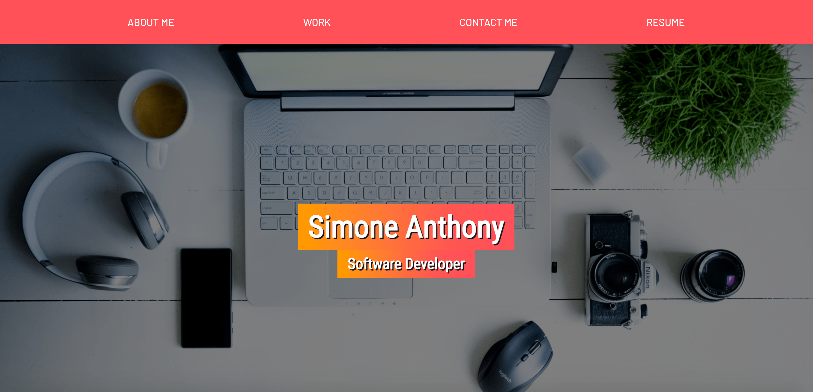

# Personal Portfolio

## Description
This is a mock porfolio site displaying basic web design and
responsive design skills. It utilizes "desktop first" css
stylings. It also demonstrates the use of pseudo-elements and
an understanding of display flex. Technology: HTML, CSS, JS,
Bootstrap.

## Visuals

## Deployed Links

* [The URL of the deployed application.](https://simone188535.github.io/Personal-Portfolio/)

* [The URL of the GitHub repository.](https://github.com/simone188535/Personal-Portfolio)

## Contact
[simone.anthony1@yahoo.com](mailto:simone.anthony1@yahoo.com)

## License
[MIT](https://choosealicense.com/licenses/mit/)

